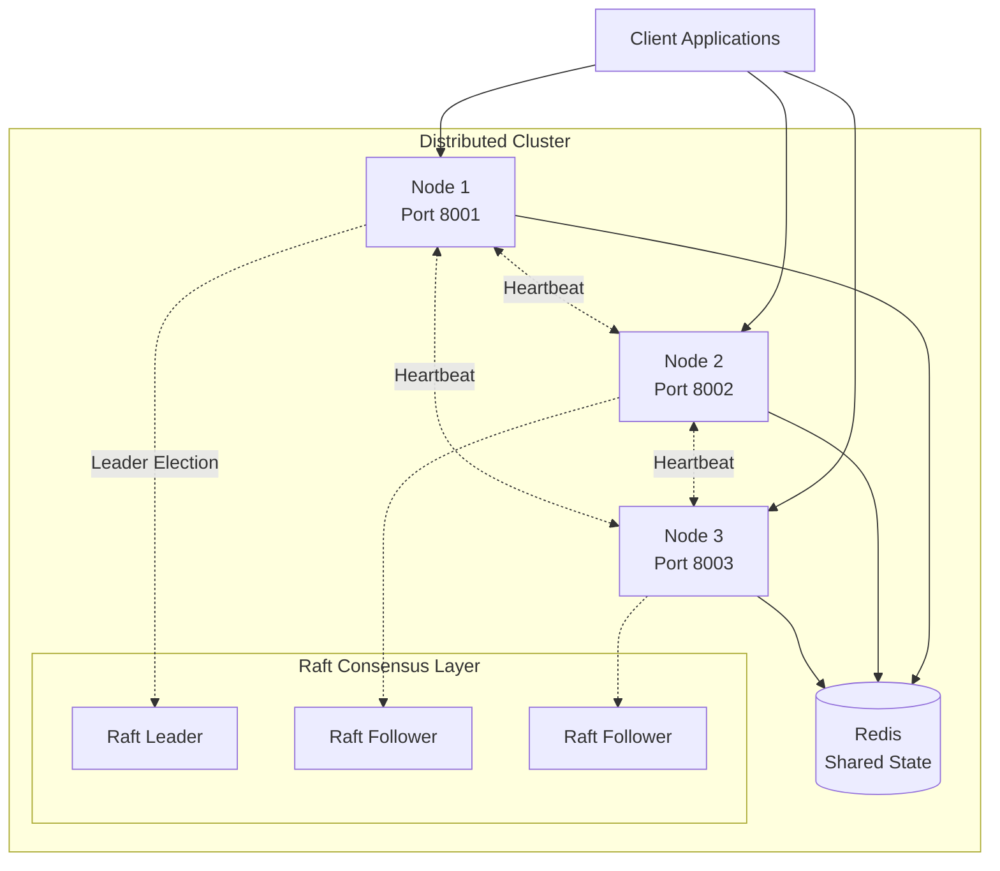
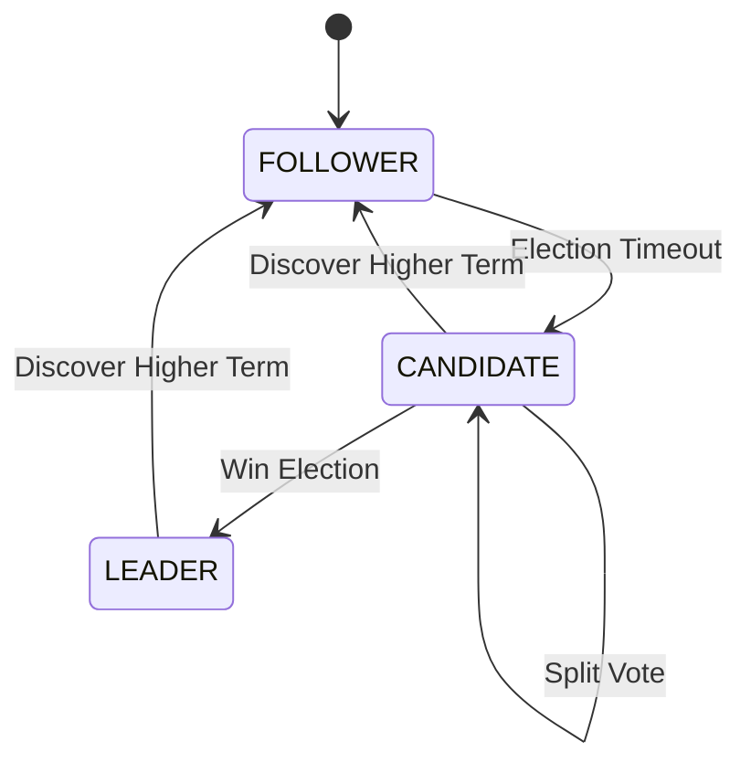
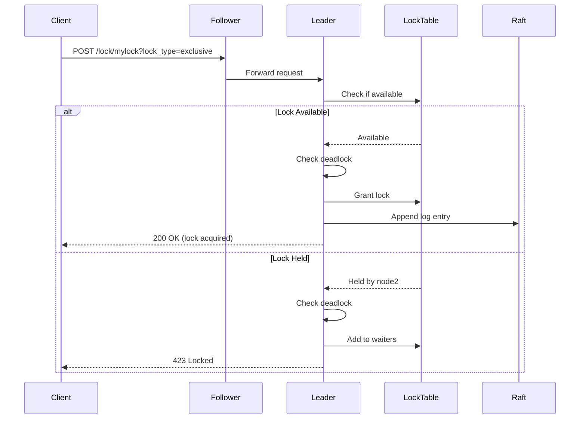
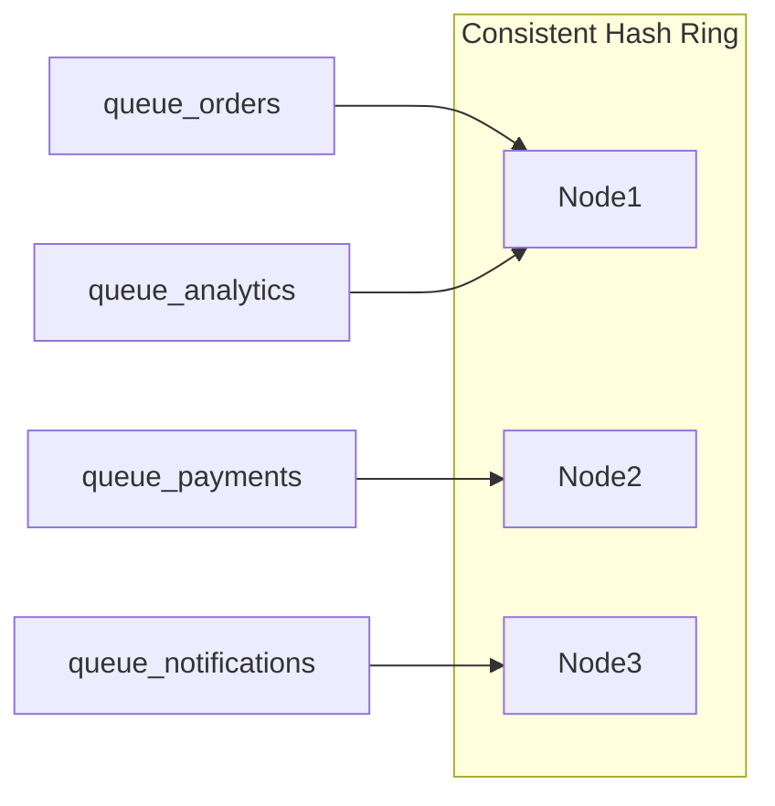
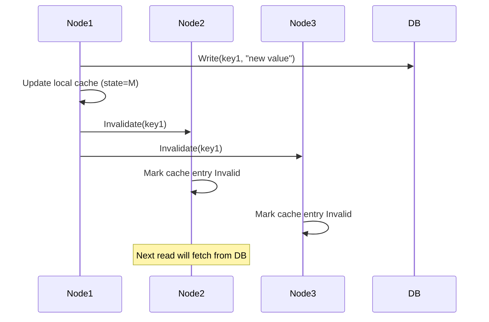

# Distributed Synchronization System - Architecture

## System Overview

This is a distributed synchronization system implementing three core components:
1. **Distributed Lock Manager** using Raft consensus
2. **Distributed Queue System** using consistent hashing
3. **Distributed Cache Coherence** with LRU eviction and MESI-like protocol

## Architecture Diagram



## Component Architecture

### 1. Raft Consensus Module

**Location**: `src/consensus/raft.py`

**Purpose**: Provides distributed consensus for lock management and ensures consistency across nodes.

**Key Features**:
- Leader election with randomized timeouts (5-10 seconds)
- Log replication with consistency checks
- Heartbeat mechanism (1 second interval)
- Automatic failover on leader failure
- Support for log entry appending and commit tracking

**State Machine**:


**Data Structures**:
- `log`: List of log entries `[{"term": int, "command": dict}]`
- `current_term`: Current term number
- `voted_for`: Candidate ID voted for in current term
- `commit_index`: Index of highest log entry known to be committed
- `leader_id`: ID of the current leader

### 2. Distributed Lock Manager

**Location**: `src/nodes/lock_manager.py`

**Purpose**: Provides distributed locking with deadlock detection.

**Lock Types**:
- **Exclusive Lock**: Only one node can hold the lock
- **Shared Lock**: Multiple nodes can hold the lock simultaneously

**Deadlock Detection**:
- Uses wait-for graph to track dependencies
- Cycle detection algorithm (DFS-based)
- Rejects lock requests that would create cycles

**Lock Flow**:


### 3. Distributed Queue System

**Location**: `src/nodes/queue_node.py`

**Purpose**: Provides distributed message queue with at-least-once delivery.

**Key Features**:
- Consistent hashing for queue distribution
- Message persistence via Redis
- At-least-once delivery guarantee
- Automatic request forwarding to responsible node

**Queue Distribution**:


**Message Flow**:
1. Producer sends message to any node
2. Node uses consistent hashing to determine responsible node
3. If not responsible, forwards to correct node
4. Message stored in Redis list
5. Consumer retrieves message (moved to processing queue)
6. Consumer ACKs message (removed from processing queue)

### 4. Distributed Cache Coherence

**Location**: `src/nodes/cache_node.py`

**Purpose**: Provides distributed caching with coherence protocol.

**Cache States** (MESI-like):
- **M (Modified)**: Cache line is dirty, exclusive to this node
- **S (Shared)**: Cache line is clean, may exist in other caches
- **I (Invalid)**: Cache line is invalid

**Coherence Protocol**:


**LRU Eviction**:
- Uses `OrderedDict` to maintain access order
- Evicts least recently used entry when cache is full
- Thread-safe with locking

## Communication Patterns

### Inter-Node Communication

**Protocol**: HTTP/JSON over REST API

**Message Types**:
1. **Raft RPCs**:
   - `POST /raft/request-vote`: Request votes during election
   - `POST /raft/append-entries`: Heartbeat and log replication

2. **Lock Operations**:
   - `POST /lock/{name}`: Acquire lock
   - `DELETE /lock/{name}`: Release lock
   - `GET /lock/{name}`: Get lock status

3. **Queue Operations**:
   - `POST /queue/{name}`: Produce message
   - `GET /queue/{name}`: Consume message
   - `POST /queue/ack/{processing_queue}`: Acknowledge message

4. **Cache Operations**:
   - `GET /cache/{key}`: Read from cache
   - `POST /cache/{key}`: Write to cache
   - `POST /cache/invalidate/{key}`: Invalidate cache entry

### Failure Handling

**Leader Failure**:
1. Followers stop receiving heartbeats
2. Election timeout triggers (5-10 seconds)
3. Follower transitions to candidate
4. New election begins
5. New leader elected within ~10-15 seconds

**Node Failure**:
- Queue messages persist in Redis
- Cache entries lost on failed node
- Locks held by failed node remain until timeout (future enhancement)

**Network Partition**:
- Raft ensures only one leader per term
- Minority partition cannot make progress
- Majority partition continues operating
- Partitions reconcile when network heals

## Data Flow

### Write Path (Cache)
```
Client → Node → Update Local Cache (M) → Update DB → Broadcast Invalidate → Other Nodes Mark Invalid
```

### Read Path (Cache)
```
Client → Node → Check Local Cache → (Hit) Return → (Miss) Fetch from DB → Store in Cache (S) → Return
```

### Lock Acquisition Path
```
Client → Any Node → Forward to Leader → Check Availability → Check Deadlock → Grant/Deny → Replicate via Raft
```

### Queue Message Path
```
Producer → Any Node → Hash(queue_name) → Forward to Responsible Node → Store in Redis → Consumer Retrieves → ACK
```

## Performance Characteristics

**Raft Consensus**:
- Leader election: 5-15 seconds
- Heartbeat interval: 1 second
- Log replication: Synchronous to majority

**Distributed Locks**:
- Acquisition latency: ~10-50ms (leader) or ~50-200ms (follower with forwarding)
- Deadlock detection: O(N) where N = number of nodes

**Distributed Queue**:
- Throughput: ~1000-5000 messages/second (limited by Redis)
- Latency: ~5-20ms (same node) or ~20-100ms (forwarded)

**Distributed Cache**:
- Hit latency: ~1-5ms
- Miss latency: ~10-50ms
- Invalidation propagation: ~50-200ms

## Scalability

**Horizontal Scaling**:
- Add more nodes to the cluster
- Update `ALL_NODES` environment variable
- Restart cluster for consistent hashing to redistribute

**Limitations**:
- Raft requires majority for progress (odd number of nodes recommended)
- All nodes must be able to communicate with each other
- Redis is a single point of failure (can be clustered separately)

## Security Considerations

**Current Implementation**:
- No authentication or encryption
- Suitable for trusted internal networks only

**Future Enhancements**:
- TLS for inter-node communication
- JWT-based authentication
- RBAC for lock and queue access
